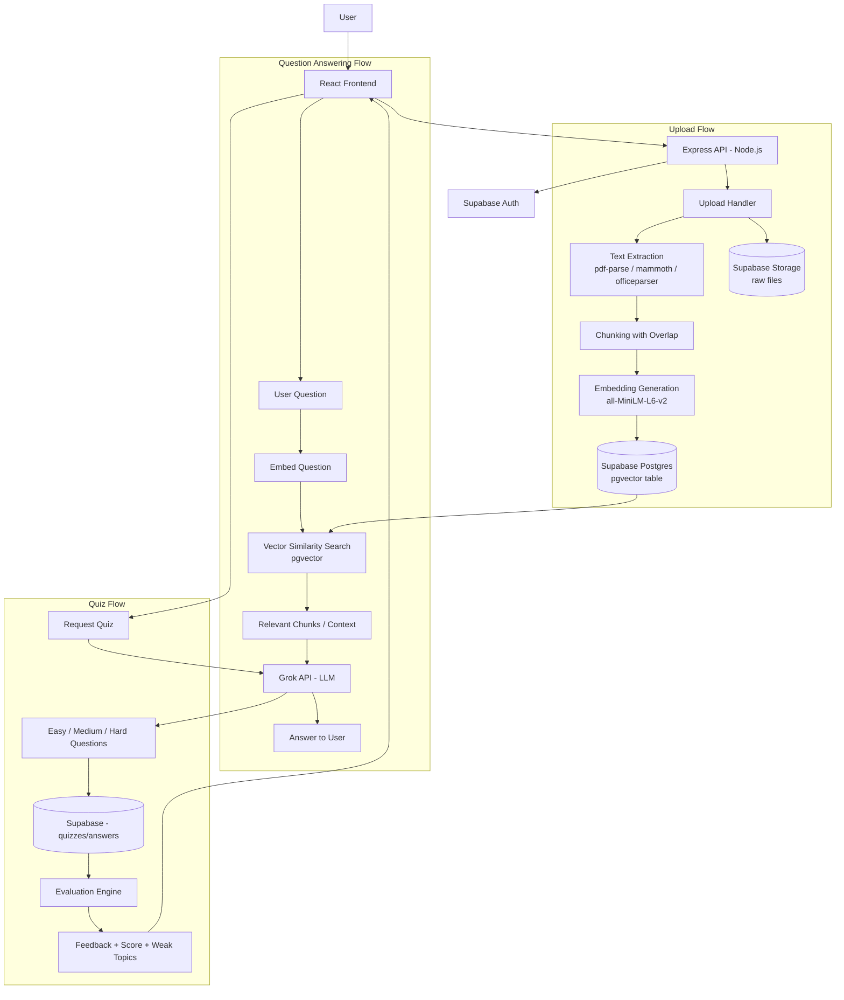

# Technical Report

## AI-Based Personalized Learning Tutor System

### 1. Project Overview

The AI-Based Personalized Learning Tutor System is a Retrieval-Augmented Generation (RAG) application that allows students to upload study materials (PDF, DOCX, PPT), ask questions from those materials, and receive accurate AI-generated answers. The system also generates adaptive quizzes and personalized feedback.

This build is developed using **Antigravity** (as the agentic build environment), on a **MERN-style stack** with **Supabase** replacing MongoDB as the primary database, and **Grok (xAI)** as the LLM provider instead of Gemini.

## 2. Problem Statement

Traditional learning systems are static and not personalized. Students often struggle to understand concepts from large documents because they lack interactive guidance and context-aware assistance. Existing systems generally provide generic AI responses or fixed quizzes rather than answers based on user-specific study material.

The proposed system solves this by:

* Processing uploaded study materials.
* Retrieving relevant content using semantic search.
* Generating context-aware answers using the Grok API.
* Creating adaptive quizzes with personalized feedback.

## 3. Objectives

* Upload PDF, DOCX and PPT files.
* Extract document text.
* Generate embeddings.
* Store embeddings/vectors in Supabase (pgvector).
* Answer questions using RAG.
* Generate adaptive quizzes.
* Provide feedback and scores.

## 4. Features

### Document Processing

* Upload PDF, DOCX, PPT.
* Text extraction.
* Chunking with overlap.
* Embedding generation.
* Vector storage in Supabase (pgvector extension).

### Question Answering

* Natural language questions.
* Context-aware responses.
* RAG pipeline powered by Grok.

### Quiz Module

* AI-generated questions (Grok).
* Easy, Medium and Hard levels.
* Adaptive difficulty.
* Automatic evaluation.

### Feedback

* Correct answer.
* Explanation.
* Score.
* Weak topics.
* Suggestions.

### Authentication & Storage

* Supabase Auth for user login/signup (email, OAuth).
* Supabase Storage for raw uploaded files (PDF/DOCX/PPT).
* Supabase Postgres (with pgvector) for structured data + embeddings.

## 5. Tech Stack

| Layer | Technology |
|---|---|
| Frontend | React (Vite), Tailwind CSS |
| Backend | Node.js, Express.js |
| Database | Supabase (PostgreSQL + pgvector) |
| Auth | Supabase Auth |
| File Storage | Supabase Storage |
| Embedding Model | all-MiniLM-L6-v2 (via `@xenova/transformers` or a hosted embedding endpoint) |
| LLM | Grok API (xAI) |
| Vector Search | pgvector (Supabase), cosine similarity |
| Build/Dev Environment | Antigravity |
| Document Parsing | `pdf-parse`, `mammoth` (DOCX), `pptx2json` / `officeparser` (PPT) |

## 6. Architecture



**Flow summary:**

1. **Upload:** User uploads a file → Express handles it → text is extracted → chunked with overlap → embeddings generated → embeddings + metadata stored in Supabase (pgvector) → raw file stored in Supabase Storage.
2. **Ask:** User question is embedded → similarity search runs against pgvector → top-matching chunks are pulled as context → context + question sent to Grok → answer returned to the frontend.
3. **Quiz:** Grok generates leveled questions from the document context → stored in Supabase → user submits answers → evaluation logic scores them → feedback (weak topics, suggestions) generated, optionally re-using Grok for explanations.

## 7. Technology Stack Summary

Frontend: React, Tailwind CSS, Axios
Backend: Node.js, Express.js
Database: Supabase (PostgreSQL + pgvector)
Auth: Supabase Auth
Storage: Supabase Storage
LLM: Grok API (xAI)
Embedding Model: all-MiniLM-L6-v2
Libraries: `express`, `multer`, `pdf-parse`, `mammoth`, `officeparser`, `@supabase/supabase-js`, `@xenova/transformers` (or embedding API of choice), `axios`, `dotenv`, `cors`

## 8. Workflow

1. Upload document.
2. Extract text.
3. Split into chunks (with overlap).
4. Generate embeddings.
5. Store embeddings + file reference in Supabase.
6. User asks question.
7. Retrieve relevant chunks via pgvector similarity search.
8. Grok generates answer using retrieved context.
9. Generate adaptive quiz via Grok.
10. Evaluate submitted answers.
11. Return feedback and score.

## 9. Project Structure

Since the project is started **directly at the root** (no wrapping `project/` folder), the structure looks like this:

```
.
├── frontend/
│   ├── src/
│   │   ├── components/
│   │   ├── pages/
│   │   ├── hooks/
│   │   ├── lib/          # supabase client, api client
│   │   └── App.jsx
│   ├── index.html
│   ├── package.json
│   └── vite.config.js
│
├── backend/
│   ├── src/
│   │   ├── routes/
│   │   │   ├── upload.routes.js
│   │   │   ├── ask.routes.js
│   │   │   ├── quiz.routes.js
│   │   │   └── feedback.routes.js
│   │   ├── controllers/
│   │   │   ├── upload.controller.js
│   │   │   ├── rag.controller.js
│   │   │   ├── quiz.controller.js
│   │   │   └── feedback.controller.js
│   │   ├── services/
│   │   │   ├── embeddings.service.js
│   │   │   ├── grok.service.js
│   │   │   ├── supabase.service.js
│   │   │   └── textExtraction.service.js
│   │   ├── config/
│   │   │   └── config.js
│   │   └── server.js
│   ├── package.json
│   └── .env
│
├── supabase/
│   └── migrations/       # SQL for pgvector table, quizzes, feedback tables
│
├── .gitignore
├── README.md
└── package.json          # root-level scripts (concurrently run frontend+backend)
```

Both `frontend` and `backend` sit directly under the repo root alongside `supabase/` (for SQL migrations), so there's no extra nesting layer — the root **is** the project.

## 10. APIs

```
POST   /api/upload          - upload PDF/DOCX/PPT, extract + embed + store
POST   /api/ask             - ask a question, returns RAG answer via Grok
POST   /api/generate-quiz   - generate adaptive quiz from a document
POST   /api/submit-quiz     - submit answers for evaluation
GET    /api/feedback/:id    - fetch score, weak topics, suggestions
GET    /api/documents       - list user's uploaded documents
```

## 11. Supabase Schema (high level)

* `documents` — id, user_id, filename, storage_path, created_at
* `chunks` — id, document_id, content, embedding (vector), chunk_index
* `quizzes` — id, document_id, difficulty, questions (jsonb), created_at
* `quiz_attempts` — id, quiz_id, user_id, answers (jsonb), score, weak_topics (jsonb)

(`chunks.embedding` uses the `vector` type from the pgvector extension, enabled via a Supabase migration.)

## 12. Non-functional Requirements

* Fast vector retrieval (pgvector indexing — IVFFlat or HNSW)
* Modular architecture (routes/controllers/services separation)
* Scalable backend (stateless Express, Supabase handles DB scaling)
* Secure API key management (Grok API key + Supabase service key in `.env`, never exposed to frontend)
* Easy model/provider replacement (LLM and embedding calls abstracted into their own service files)

## 13. Future Scope

* Voice support
* Multilingual support
* Teacher dashboard
* Cloud deployment (Vercel for frontend, Render/Railway for backend)
* Analytics dashboard
* Real-time collaboration via Supabase Realtime

## 14. Expected Outcome

An AI tutor capable of answering questions from uploaded study materials, generating adaptive quizzes, and providing personalized feedback — built on React, Node/Express, Supabase (Postgres + pgvector), and the Grok API, developed within Antigravity, with the project rooted directly at the repository root.